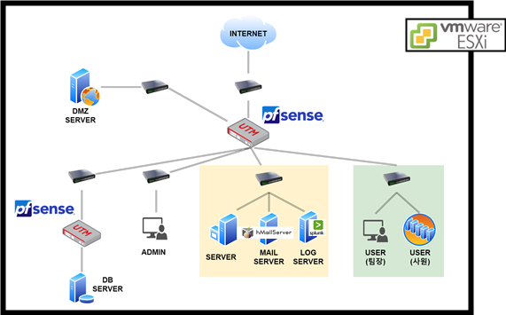
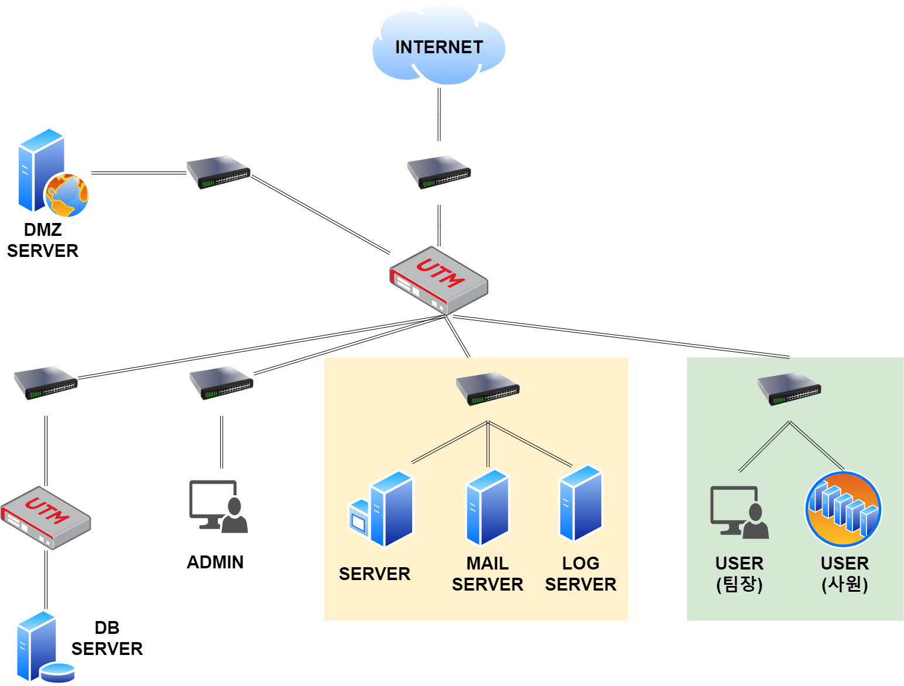
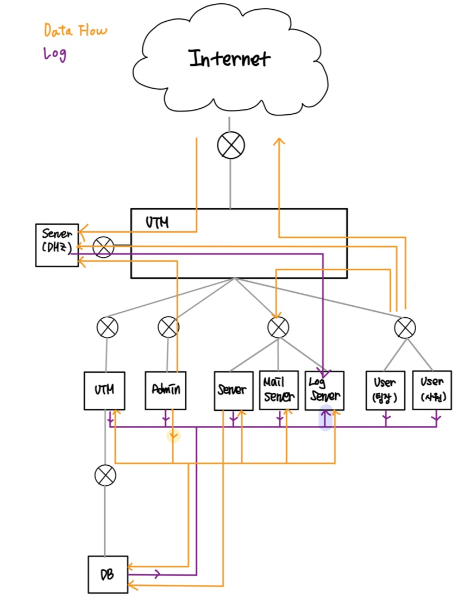
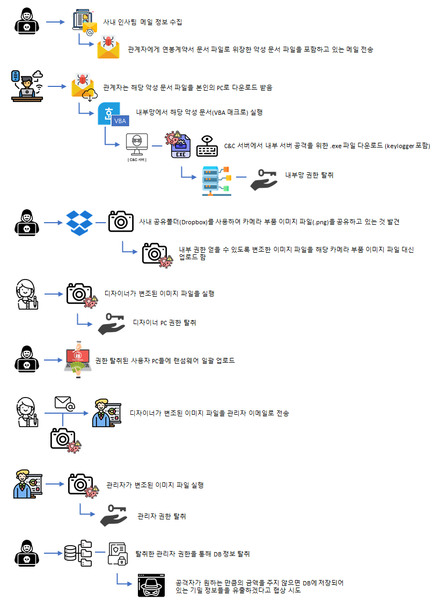
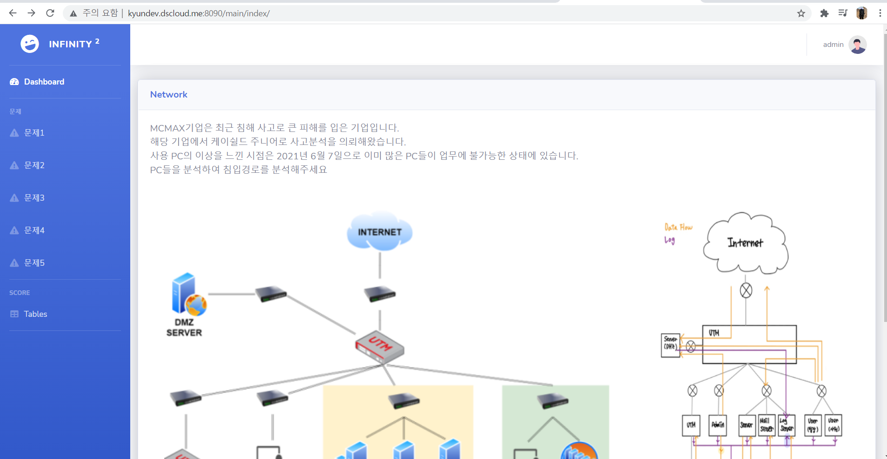
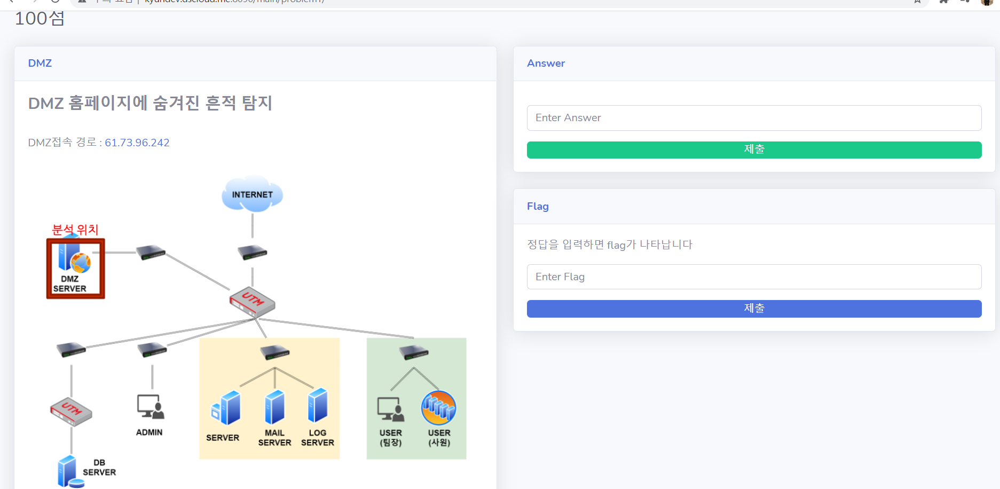

# 교육 환경 제공을 위한 시나리오 기반 모의 해킹과 사고 분석

## 1. 배경
#### 1) 모의해킹(Pen Testing)
- 시스템 장비, 네트워크 장비 등 실제 운영 중인 서비스를 대상으로 공격자와 동일한 환경에
   서 여러 해킹 툴을 이용해 내부 시스템에 침투가 가능한지 테스트하는 작업

- 해킹 공격은 지속적으로 발생하고 있으며, 기업들의 보안사고도 빈번히 발생하고있다.
   특히, 금융권, 쇼핑몰, 게임 서비스 등의 상황에서 다운될 경우 기업 이미지와 신뢰도, 재정
   에 상당한 타격이 생기는 경우가 많다.

#### 2) 침해사고 교육의 한계점
- 침해사고를 연구해볼 수 있는 이미지 자료들은 기업 보안과 직결된 민감한 문제라 쉽게 공유되어지지 않는다.
- 초심자의 경우 실제 공격가능한 환경을 구하는 것이 힘들기 때문에 학습을 하고 싶어도 할 수 없는 경우가 많다.

## 2. 프로젝트 목표
- 누구나 쉽게 침해사고 연구가 가능한 이미지 제공
- CTF 문제 제공을 통한 초심자 역량 강화
- 망에 대한 모의해킹이 가능한 환경 제공

## 3. 소프트웨어

## 4. 망 구성도

## 5. 데이터 흐름도

## 6. 공격 시나리오

## 7. CTF

